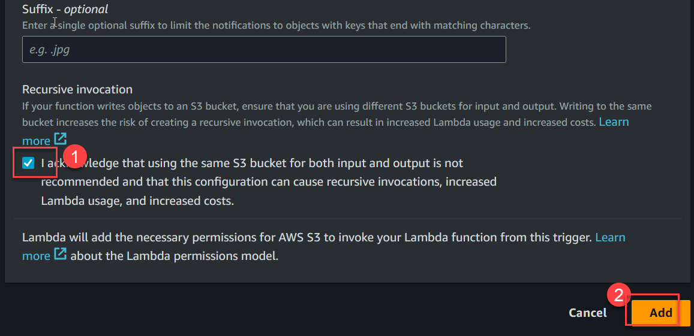
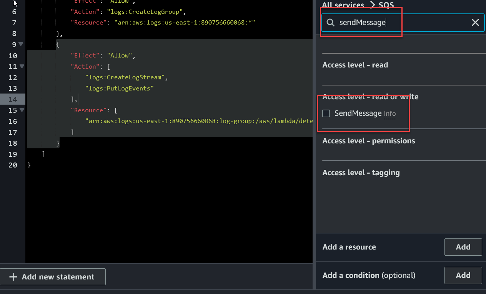

AWS Lambda is a serverless computing service provided by Amazon Web Services (AWS) that allows you to run your code without provisioning or managing servers. It's a part of the AWS serverless platform, and it enables you to build and deploy applications or services without worrying about the underlying infrastructure.

Here are the key components and concepts related to AWS Lambda:

1. **Serverless Computing:**
   - With serverless computing, you don't need to worry about traditional server management tasks such as server provisioning, maintenance, or scaling.
   - AWS Lambda automatically scales your applications in response to incoming traffic, ensuring that your functions are always available.

1. **Lambda Functions:**
   - AWS Lambda executes your code in response to specific events. These events can be changes to data in an Amazon S3 bucket, updates to a DynamoDB table, or HTTP requests via API Gateway, among others.
   - A Lambda function is the unit of execution, and it consists of the code you want to run, as well as associated configuration information, such as the amount of memory to allocate to the function.

1. **Event Sources:**
   - Lambda functions are triggered by events. These events can come from various AWS services or custom sources.
   - Examples of event sources include S3 buckets, DynamoDB tables, SNS topics, CloudWatch Events, and API Gateway. When an event occurs, it triggers the associated Lambda function.

1. **Languages and Runtimes:**
   - AWS Lambda supports multiple programming languages, including Node.js, Python, Java, Go, Ruby, and .NET Core.
   - You upload your code as a deployment package (a ZIP archive) along with any dependencies. AWS Lambda automatically provisions and runs the compute capacity needed to execute your code.

1. **Execution Role:**
   - When you create a Lambda function, you associate it with an execution role. This role defines the permissions the function has, allowing it to access other AWS resources such as S3 buckets or DynamoDB tables.

1. **Stateless Execution:**
   - AWS Lambda is designed for stateless execution, meaning each function execution is independent. Any state that needs to be maintained between function invocations should be stored externally, such as in a database.

1. **Billing Model:**
   - With AWS Lambda, you pay only for the compute time that you consume. You are charged based on the number of requests for your functions and the time your code executes. There are no upfront fees or fixed costs.

AWS Lambda is commonly used in various scenarios, including building serverless applications, automating tasks, handling real-time file processing, and creating event-driven microservices architectures. It enables developers to focus on writing code and building applications without managing the underlying infrastructure.

## [DEMO] AWS Lambda function that uses `S3 Event` as trigger and then send a message in Queue as a response.

## Prerequisites

1. Create a new S3 bucket, lets assume 'buck0887' 
1. Create a new SQS Queue, lets assume 'queue1', you need to note its URL and ARN for later use.

    

1. Create a new Lambda function with Language python 3.12 (From Scratch)

1. Add Trigger for function
	Resource : S3
	Name: S3 bucket from step#1
	Event Type: All creation events

    
    
    

1. Click on `Configuration` tab and goto permissions, to allow lambda function to `sendMessage` on SQS Queue `queue1`
    You need to click on `Custom role name` which should take you to new browser tab (IAM Console)

    
    
1.  There should be a new Policy created, click on policy name.

    

1.  There is only ONE permission, for writing logs, Now click `Edit` button to add one more permission.

    


1.  Using Search panel on right, search for SQS and then select `SQS`

    

1.  Search for Operation "sendMessage" use checkbox to enable/select sendMessage event

    

1.  Click `Add` button to add the Queue ARN

    

1.  Select service `SQS` and resource type `Queue` then enter the ARN of queue1

    

1.  Click `Next` button

    

1.  Save changes made to IAM Role.

    

1.  Go back to previous window/tab where Lambda function is still open, click on `Code` tab. then copy the following code (Modify the code first, you need to update `queue_url` variable)

    

    Save the changes using `File > Save` and then click `Deploy` button to upload modified lambda function.

    ```python
    import json
    import boto3

    def lambda_handler(event, context):
        # Extract S3 event details
        s3_event = event['Records'][0]['s3']
        bucket_name = s3_event['bucket']['name']
        object_key = s3_event['object']['key']

        # Create SQS client
        sqs = boto3.client('sqs')

        # URL of your SQS queue
        queue_url = 'https://sqs.us-east-1.amazonaws.com/890756660068/queue1'

        # Create a message for SQS
        message = {
            'bucket': bucket_name,
            'object_key': object_key
        }

        # Send message to SQS
        response = sqs.send_message(
            QueueUrl=queue_url,
            MessageBody=json.dumps(message)
        )

        print(f"Message sent to SQS. Response: {response}")

        return {
            'statusCode': 200,
            'body': json.dumps('Message sent to SQS successfully!')
        }
    ```

1.  To test, open the S3 bucket and try uploading any file.

Here's a breakdown of the code:

1. The `lambda_handler` function is the entry point for the Lambda function.
2. It extracts information about the S3 event (bucket name and object key) from the Lambda event input.
3. It creates an SQS client using Boto3.
4. It constructs a message containing information about the newly uploaded file.
5. It sends the message to the specified SQS queue using the `send_message` method.

Make sure to replace `'YOUR_SQS_QUEUE_URL'` with the actual URL of your SQS queue. Additionally, you need to configure the S3 bucket to trigger the Lambda function on object creation events.


## [Java Demo] AWS Lambda function that uses `S3 Event` as trigger and then send a message in Queue as a response.

### Step 1: Set up your environment

Make sure you have the following set up:

- AWS account
- AWS CLI installed and configured with appropriate permissions
- Java Development Kit (JDK) installed
- AWS SDK for Java 1.x in your Java project

### Step 2: Create an S3 bucket

Create an S3 bucket where you'll upload files. Note the bucket name for later use.

### Step 3: Create an SQS queue

Create an SQS queue to which the Lambda function will send messages. Note the queue URL for later use.

### Step 4: Write Java Lambda function code

Create a Java Lambda function with the following code. This code uses the AWS SDK for Java 1.x (`aws-java-sdk-s3` and `aws-java-sdk-sqs`).

> Update the POM file

```xml
<dependency>
    <groupId>com.amazonaws</groupId>
    <artifactId>aws-java-sdk-s3</artifactId>
    <version>1.12.630</version>
</dependency>
<dependency>
    <groupId>com.amazonaws</groupId>
    <artifactId>aws-java-sdk-sqs</artifactId>
    <version>1.12.630</version>
</dependency>
<dependency>
    <groupId>com.amazonaws</groupId>
    <artifactId>aws-lambda-java-events</artifactId>
    <version>3.11.4</version>
</dependency>

```

```java
import com.amazonaws.services.lambda.runtime.Context;
import com.amazonaws.services.lambda.runtime.RequestHandler;
import com.amazonaws.services.lambda.runtime.events.S3Event;
import com.amazonaws.services.s3.AmazonS3;
import com.amazonaws.services.s3.AmazonS3ClientBuilder;
import com.amazonaws.services.s3.event.S3EventNotification;
import com.amazonaws.services.sqs.AmazonSQS;
import com.amazonaws.services.sqs.AmazonSQSClientBuilder;
import com.amazonaws.services.sqs.model.SendMessageRequest;

public class S3EventProcessor implements RequestHandler<S3Event, String> {

    private final String SQS_QUEUE_URL = "YOUR_SQS_QUEUE_URL";

    public String handleRequest(S3Event s3Event, Context context) {
        context.getLogger().log("Received S3 event: " + s3Event);

        for (S3EventNotification.S3EventNotificationRecord record : s3Event.getRecords()) {
            String bucketName = record.getS3().getBucket().getName();
            String objectKey = record.getS3().getObject().getKey();

            // Process the S3 event (e.g., file upload)
            String message = "New file uploaded to S3: " + bucketName + "/" + objectKey;

            // Send message to SQS queue
            sendMessageToSQS(message);
        }

        return "Function execution completed.";
    }

    private void sendMessageToSQS(String message) {
        AmazonSQS sqs = AmazonSQSClientBuilder.defaultClient();
        sqs.sendMessage(new SendMessageRequest(SQS_QUEUE_URL, message));
    }
}
```

Replace `"YOUR_SQS_QUEUE_URL"` with the actual URL of your SQS queue.

### Step 5: Package your Lambda function

Create a JAR file containing your Lambda function code and its dependencies. You can use a build tool like Maven or Gradle for this.

### Step 6: Create Lambda function

Upload the JAR file to AWS Lambda and configure the function to use the `S3EventProcessor` class as the handler. Set the S3 bucket as the trigger for the Lambda function.

Now, when a new file is uploaded to the specified S3 bucket, the Lambda function will be triggered, and it will send a message to the SQS queue.

Note: Make sure to handle exceptions, logging, and error scenarios appropriately in a production environment.