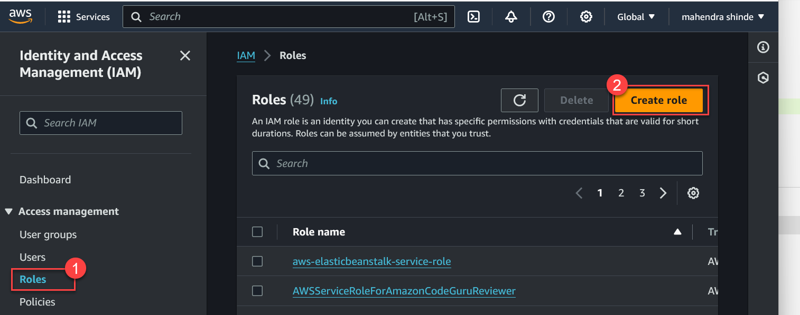
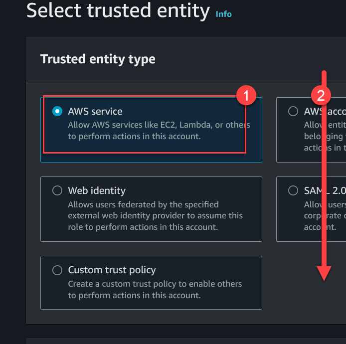
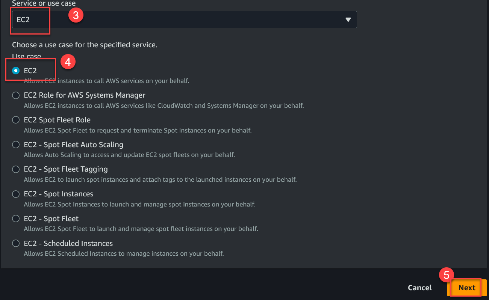
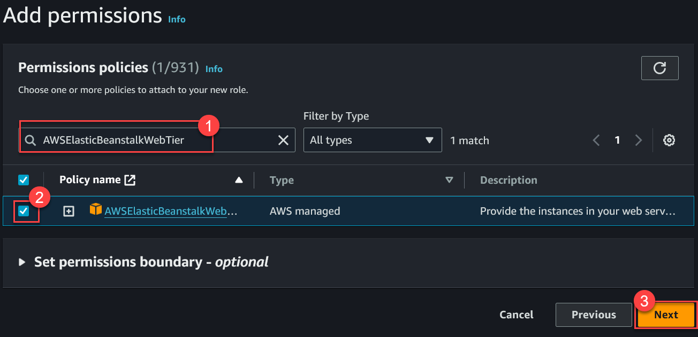
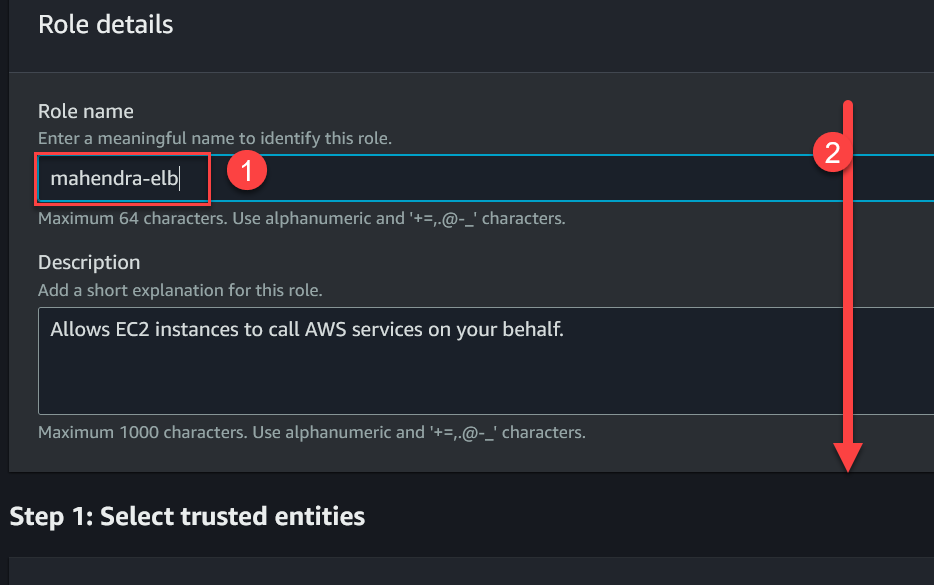
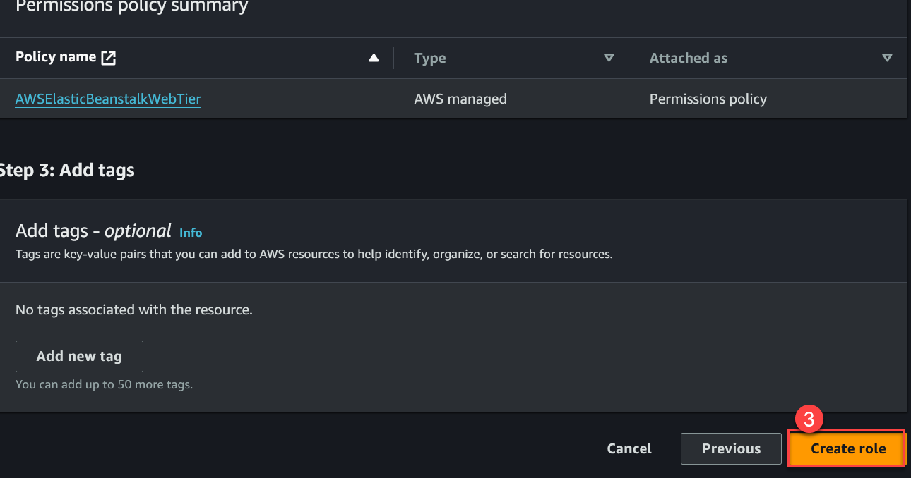

# Creating IAM Role for EC2 instances in ELB Environment

> This one is `One time Activity` and follow these steps only if you get ERROR while creating BeanStalk environment `Choose EC2 Profile` or `Incorrect EC2 profile`

1. Search for  `IAM` and open IAM Console
1. In `IAM Console` on left side menu, click on `Roles` and then `Create Role`
    

1. Choose Trusted entity type `AWS Services` and then use-case `EC2`

    
    

1.  Search for Permissions `AWSElasticBeanstalkWebTier` and once found, use checkbox to select and then click `Next`

    

1.  Provide a new name for the role, you should use this role as `EC2 profile` later in Elastic BeanStalk Environment.

    
    