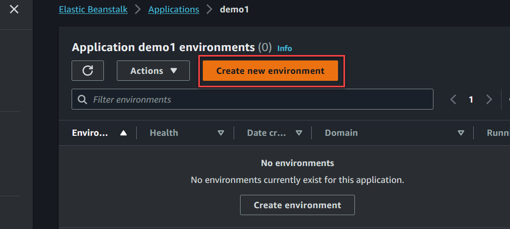
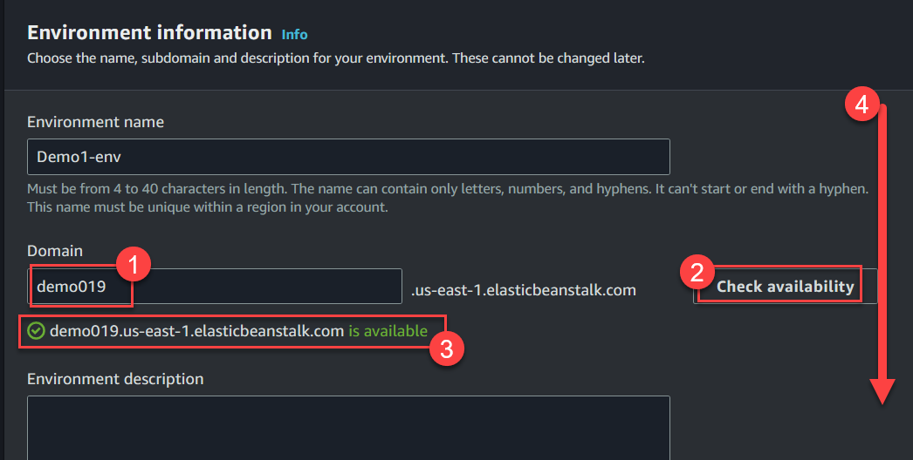
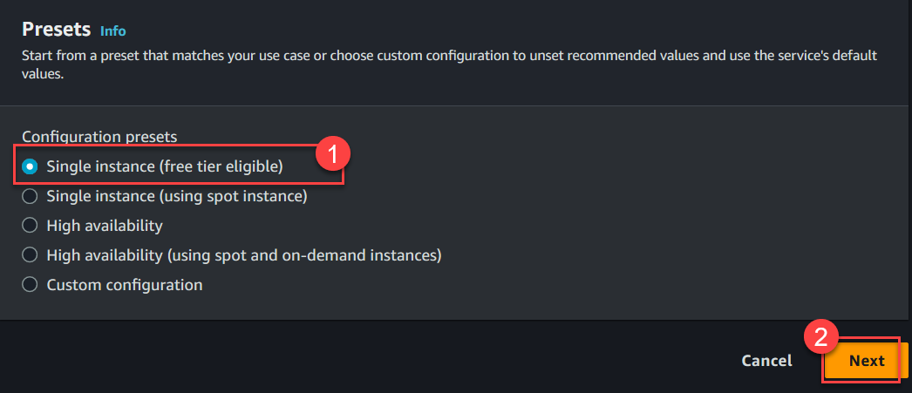
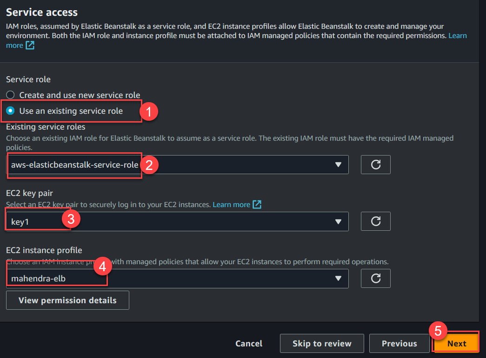
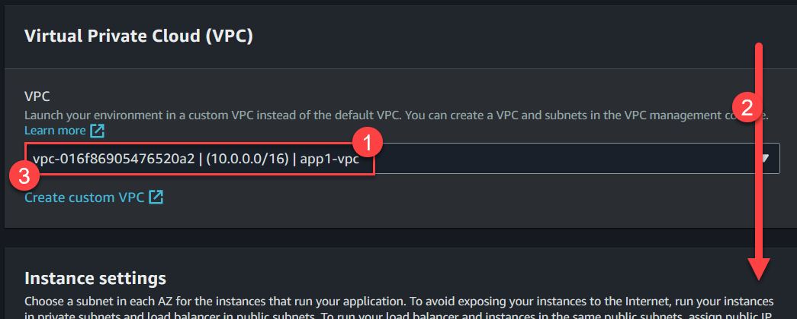
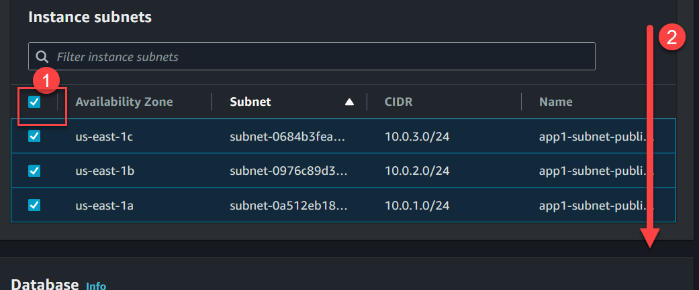
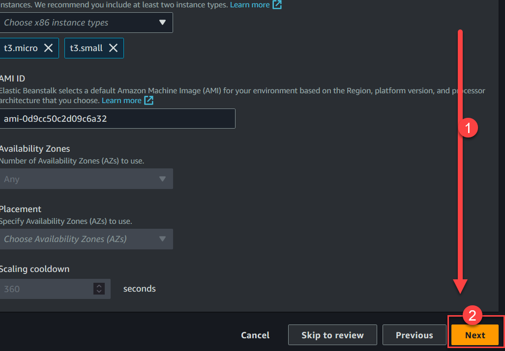
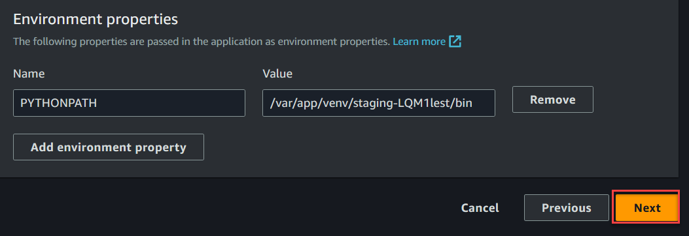

# Python (Flask) Web application on BeanStalk

1. Create a new folder for python project

    ```cmd
    mkdir flask-app
    cd flask-app
    ```

1.  Inside 'flask-app' folder create a new file `app.py`

    ```python
    from flask import Flask, render_template

    app = Flask(__name__)

    @app.route("/")
    def hello():
        return render_template('index.html')
    ```

1.  Create HTML Template `index.html` inside folder 'templates' 

    ```html
    <!DOCTYPE html>
    <html lang="en">
    <head>
        <meta charset="UTF-8">
        <link href="{{ url_for('static',filename='css/main.css') }}" rel="stylesheet"/>
        <title>Docker [Python] Demo </title>
    </head>
    <body>
        <div class="header">
        <h1>Hello Python World!</h1>
        </div>
        <div class="content">
        <p>Welcome to FlaskApp!</p>
        </div>
    </body>
    </html>
    ```

1.  Create the CSS file `main.css` in a another folder `static\css`

    ```css
    * {
        margin: 0px;
        padding: 0px;
    }

    .header {
        padding: 10px;
        background-color: cadetblue;
        font-family: 'Lucida Sans', 'Lucida Sans Regular', 'Lucida Grande', 'Lucida Sans Unicode', Geneva, Verdana, sans-serif;
        border-bottom: 5px solid darkkhaki;
    }

    .content {
        background-color: wheat;
        font-family: 'Segoe UI', Tahoma, Geneva, Verdana, sans-serif;
        padding: 5px;
        text-align: justify;
        height: 700px;
    }
    ```

1.  Convert entire folder `flask-app` to a ZIP file, make sure ZIP file contains all the files.

    > The ready to deploy ZIP is available [here](./flask-app.zip)

    

1.  Create a new BeanStalk with Python 3.11 environment

1.  Go to "Beanstalk Console" and click "Create Application" button

    

1.  Enter name of application (I have used `demo1`) and click `Create` button.

    

1.  Once application is created, use `Create new Environment` button.

    

1.  Choose type `Web Server Environment` and scroll down

    

1.  Enter the domain name and use button `Check Availability`, scroll down if domain is available, try with different name if not available.

    

1.  Platform selection: Python, Python 3.11 and scroll down

    

1.  Choose Application code : `Upload your code` and enter version label `version-1` and choose `Local file`, you need to select the ZIP file of application. Scroll down

    

1.  Choose `Preset` => Single Instance  and click `Next`

    

1.  On next screen, choose service role (if exists) otherwise choose "Create New" option. Also select any existing EC2 Key Pair.  And choose EC2 Profile created earlier 

    > Refer to [EC2 Profile for ELB](../../Learning/13-IAM-Role-for-ELB-EC2.md) for creating this EC profile.

    

    Click `Next` to continue.

1.  Choose any existing VPC (with Public Subnets) and scroll down.

    

1.  Choose all the subnets and scroll down

    

1.  Scroll down to `Next` button and click on `Next`.

    

1.  Ignore all the options, scroll down and click `Next`

    

1.  Choose `Basic` health monitoring and scroll down.

    

1.  Disable the `Managed Updates` and scroll down for `Next` button.

    

1.  Click the `Next` button.

    

1.  Scroll down and click `Submit` button.

    