# Java (Servlet / Tomcat ) Web application on BeanStalk

1. Create a maven project with name emp-demo, please refer to [sample](./emp-demo/) project

1.  Check if project is listed in `Maven` view, right click on project name and choose 
    `Run Maven Command > Package ` 

    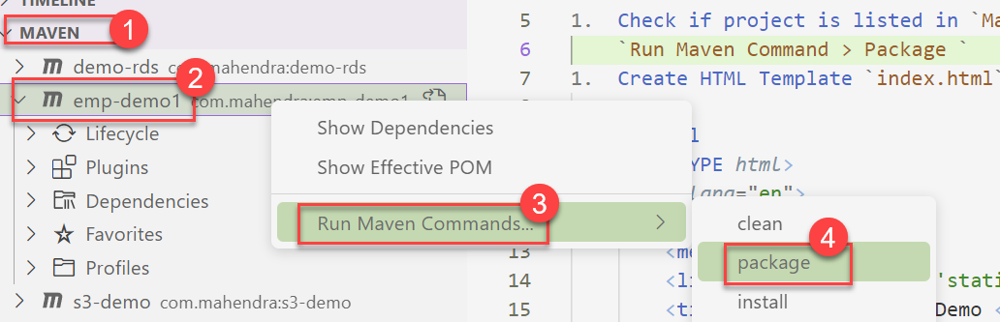

1.  Maven should have created a `WAR` under `target` folder

    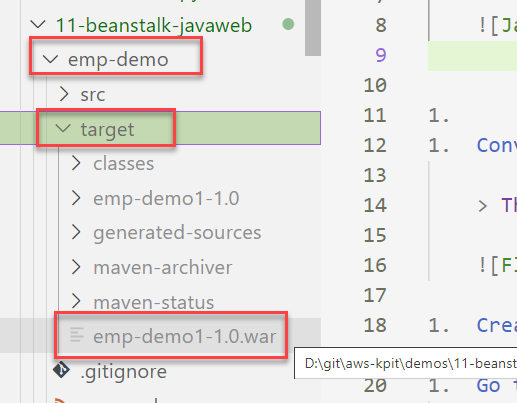

1.  Rename the generated file as `ROOT.war`

    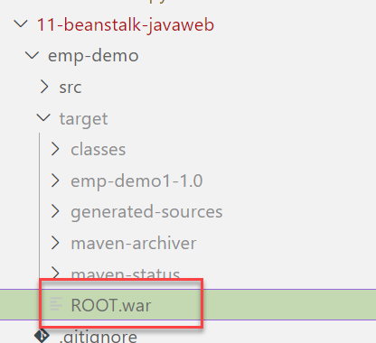

1.  Create a new BeanStalk application for Tomcat Environment.

1.  Go to "Beanstalk Console" and click "Create Application" button

    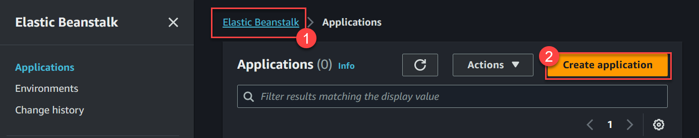

1.  Enter name of application (I have used `demo2`) and click `Create` button.

    

1.  Once application is created, use `Create new Environment` button.

    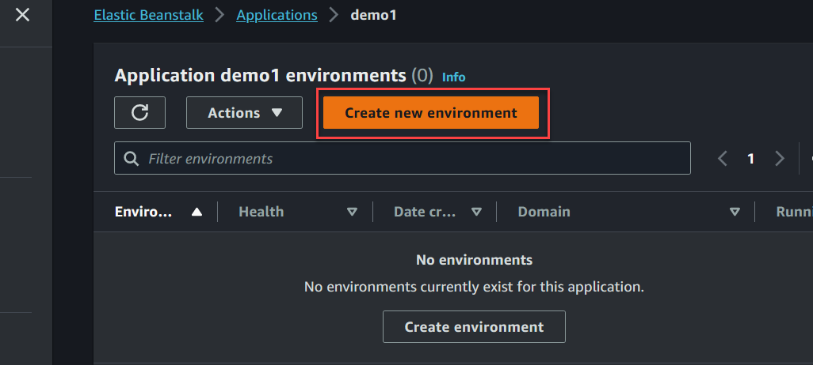

1.  Choose type `Web Server Environment` and scroll down

    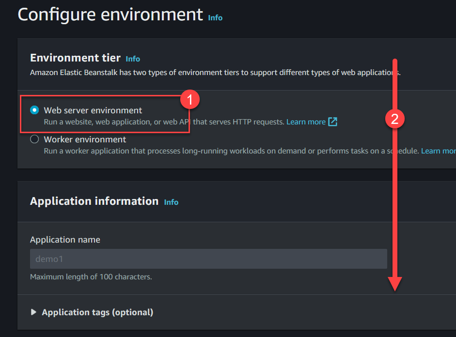

1.  Enter the domain name and use button `Check Availability`, scroll down if domain is available, try with different name if not available.

    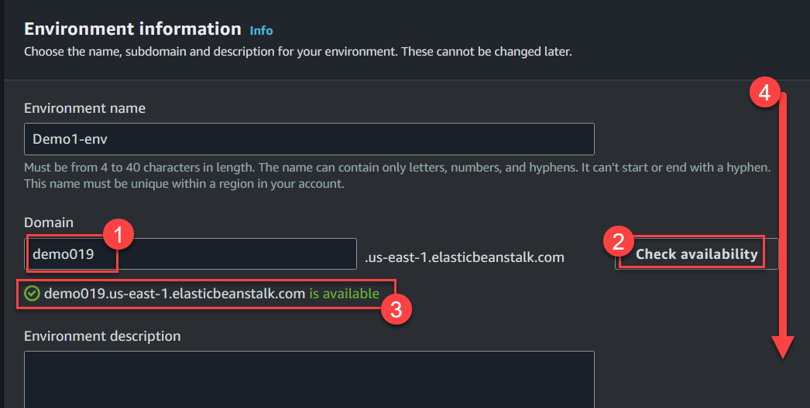

1.  Platform selection: Tomcat, Tomcat 8.5 with Corretto 11 and scroll down

    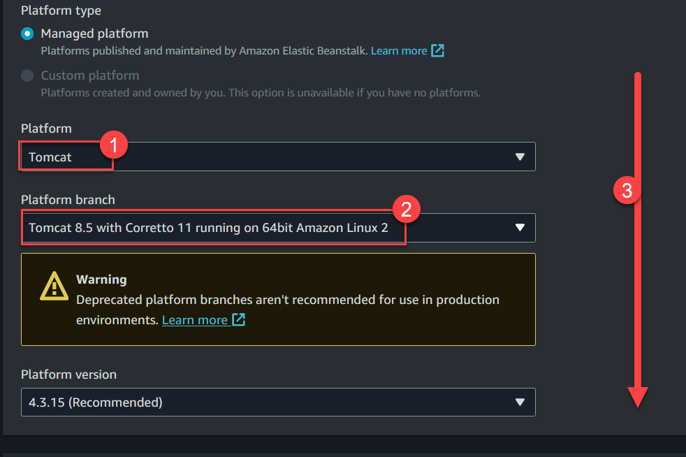

1.  Choose Application code : `Upload your code` and enter version label `version-1` and choose `Local file`, you need to select the ROOT.war file. Scroll down

    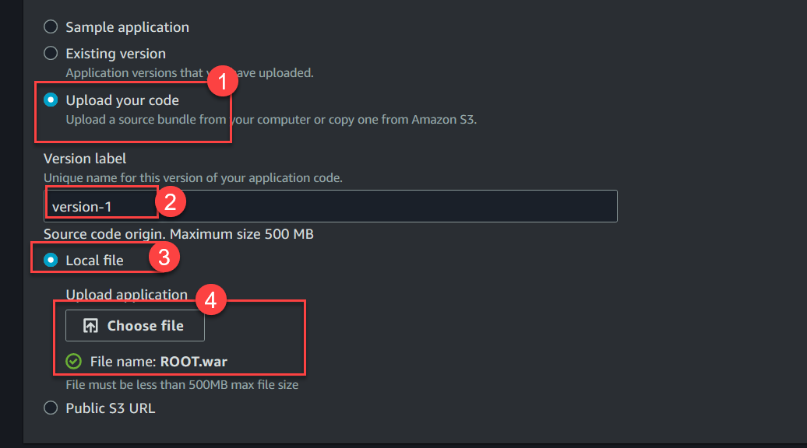

1.  Choose `Preset` => Single Instance  and click `Next`

    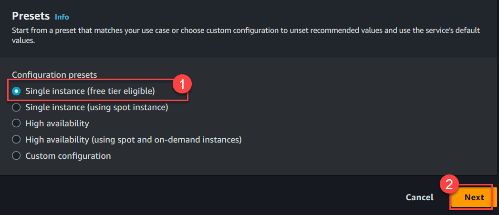

1.  On next screen, choose service role (if exists) otherwise choose "Create New" option. Also select any existing EC2 Key Pair.  And choose EC2 Profile created earlier 

    > Refer to [EC2 Profile for ELB](../../Learning/13-IAM-Role-for-ELB-EC2.md) for creating this EC profile.

    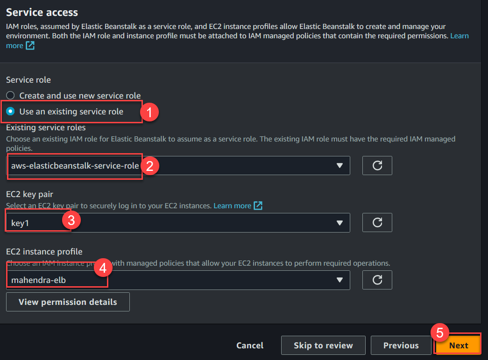

    Click `Next` to continue.

1.  Choose any existing VPC (with Public Subnets) and scroll down.

    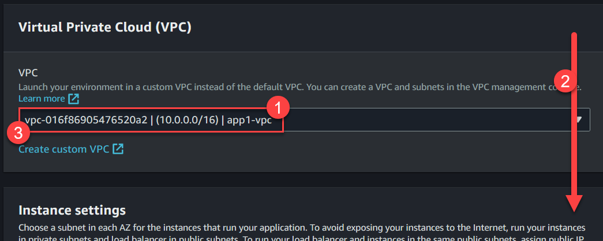

1.  Choose all the subnets and scroll down

    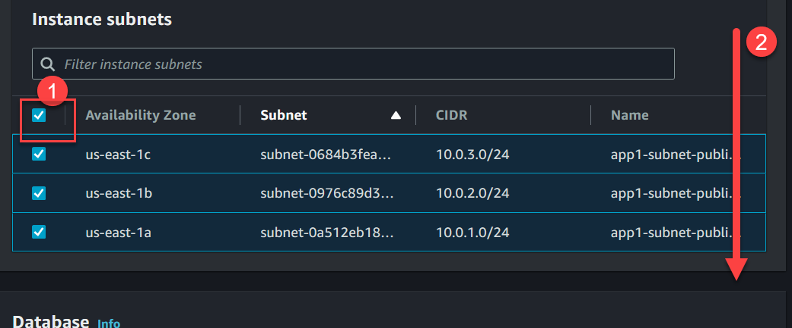

1.  Scroll down to `Next` button and click on `Next`.

    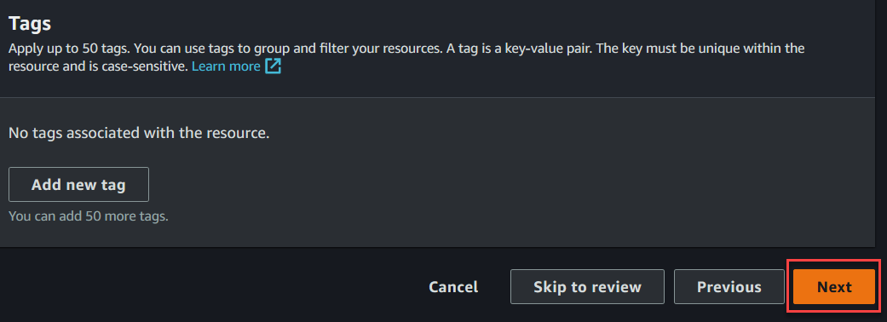

1.  Ignore all the options, scroll down and click `Next`

    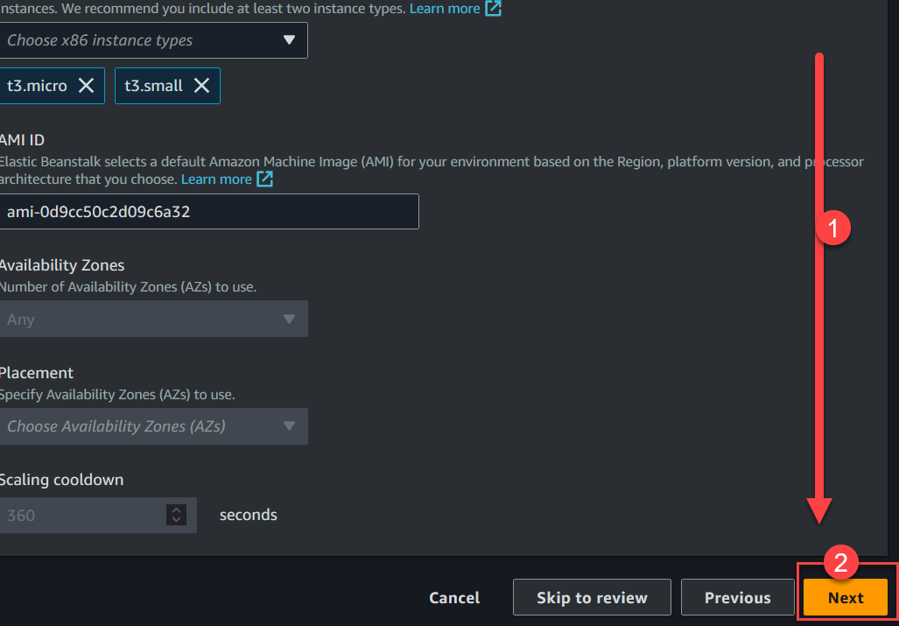

1.  Choose `Basic` health monitoring and scroll down.

    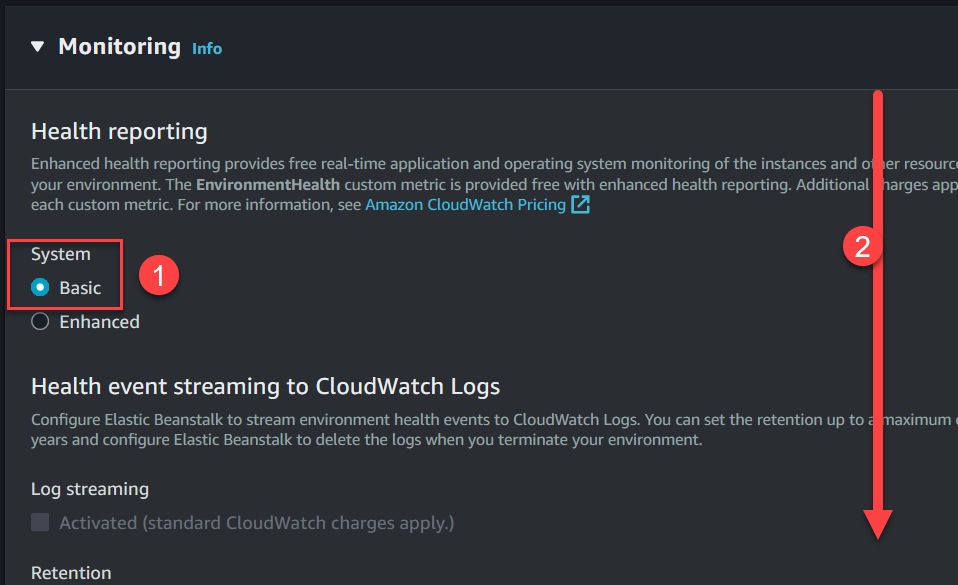

1.  Disable the `Managed Updates` and scroll down for `Next` button.

    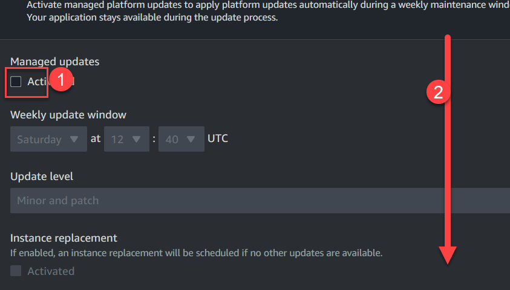

1.  Click the `Next` button.

    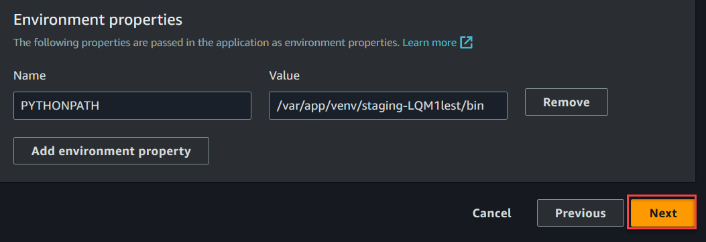

1.  Scroll down and click `Submit` button.

    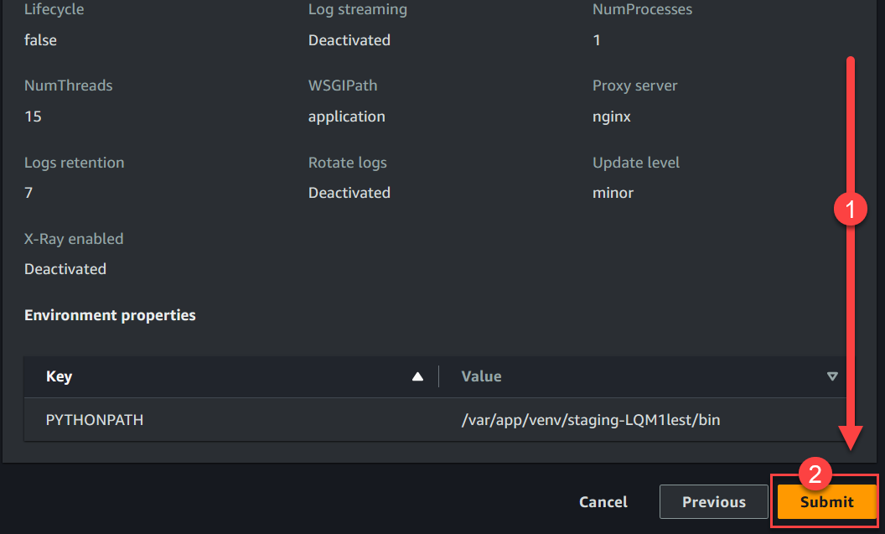